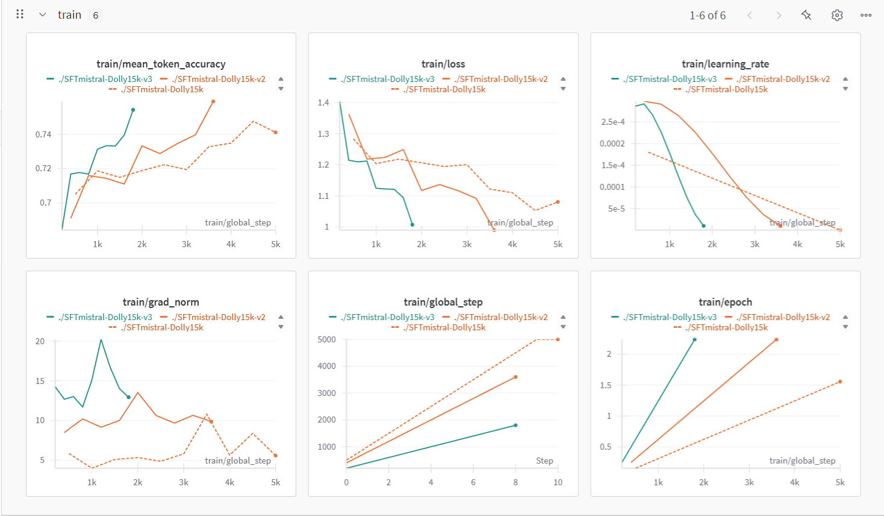

# Instruction Tuning and DPO Mistral-7B

## Overview

This document outlines the training process for fine-tuning **Mistral-7B**, which consists of two stages: **Supervised Fine-Tuning (SFT)** and **Direct Preference Optimization (DPO)**. The SFT phase adapts the model to instruction-based responses, while the DPO phase enhances preference alignment. 

## Supervised Fine-Tuning (SFT)

### Dataset

The fine-tuning uses **Databricks Dolly 15K**, a dataset containing **15,011** samples structured with `instruction`, `context`, `response`, and `category` fields. The data is filtered (length < 2500) and split into **90%-10%** for training and testing.

### Training Setup

- **Model:** Mistral-7B with QLoRA
- **Method:** QLoRA (r=16, lora_alpha=32, lora_dropout=0.05, 4-bit quantization)
- **Batch Size:** 1 per device
- **Gradient Accumulation:** 4/8/16 steps
- **Learning Rate:** 2e-4
- **Max Steps:** 5000
- **Sequence Length:** 1024 tokens
- **Optimizer:** `paged_adamw_8bit`
- **Precision:** FP16

### Training Log

---

## Direct Preference Optimization (DPO)

### Dataset

The DPO phase is trained on the **HuggingFaceH4/ultrafeedback_binarized** dataset, which provides pairwise preference data to align the model's responses more effectively with human preferences.

### Training Setup

- **Model:** Mistral-7B with QLoRA
- **Method:** Direct Preference Optimization (DPO)
- **Batch Size:** 1 per device
- **Gradient Accumulation:** 8 steps
- **Learning Rate:** 5.0e-6
- **Training Epochs:** 1
- **Sequence Length:** 1024 tokens (max prompt length: 512)
- **Optimizer:** `paged_adamw_8bit`
- **Precision:** BF16
- **Learning Rate Scheduler:** Cosine decay
- **Warmup Ratio:** 10%

## References

- Databricks Dolly 15K: [Hugging Face Dataset](https://huggingface.co/datasets/databricks/databricks-dolly-15k)
- Mistral-7B: [Hugging Face Model](https://huggingface.co/mistralai/Mistral-7B-v0.1)
- QLoRA: Efficient fine-tuning technique using quantized adapters.
- UltraFeedback Binarized: [Hugging Face Dataset](https://huggingface.co/datasets/HuggingFaceH4/ultrafeedback_binarized)

